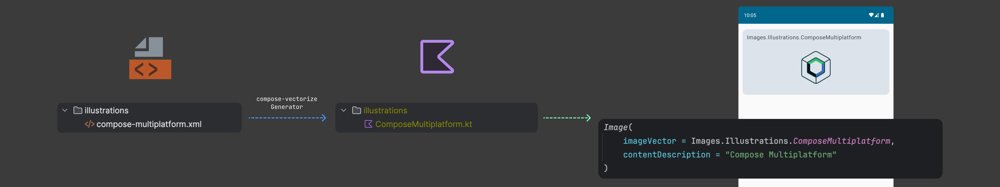

# Overview

A Kotlin Multiplatform library to generate `compose.ui.graphics.vector.ImageVector` from
`.xml` files. It is built on top of AndroidX `material-icons` vector generator, but it allows transforming not 
only solid plain icons but also illustrations and creates categories for resources automatically based on folder structure.



## Download

[](https://search.maven.org/search?q=g:dev.sergiobelda.compose.vectorize)

### Android

```kotlin
plugins {
    id("com.android.application")
    id("org.jetbrains.kotlin.android")
    id("dev.sergiobelda.compose.vectorize") version "$VERSION"
}

dependencies {
    implementation("dev.sergiobelda.compose.vectorize:compose-vectorize-core:$VERSION")
}
```

### Multiplatform

```kotlin
plugins {
    kotlin("multiplatform")
    id("org.jetbrains.compose")
    id("dev.sergiobelda.compose.vectorize") version "$VERSION"
}

kotlin {
    sourceSets {
        commonMain.dependencies {
            implementation("org.jetbrains.compose.ui:ui:$COMPOSE_MULTIPLATFORM_VERSION")
            implementation("dev.sergiobelda.compose.vectorize:compose-vectorize-core:$VERSION")
        }
    }
}
```

## License

```
   Copyright 2024 Sergio Belda

   Licensed under the Apache License, Version 2.0 (the "License");
   you may not use this file except in compliance with the License.
   You may obtain a copy of the License at

       http://www.apache.org/licenses/LICENSE-2.0

   Unless required by applicable law or agreed to in writing, software
   distributed under the License is distributed on an "AS IS" BASIS,
   WITHOUT WARRANTIES OR CONDITIONS OF ANY KIND, either express or implied.
   See the License for the specific language governing permissions and
   limitations under the License.
```